# Running Playwright Tests (hosted on GitHub) via Azure DevOps Pipeline

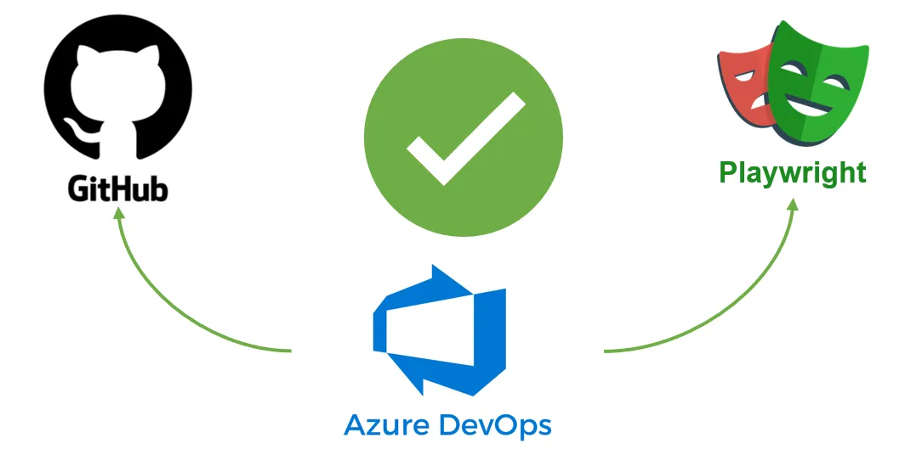

This readme explains the end-to-end process of executing Playwright tests (hosted on GitHub) via Azure DevOps Pipeline. Follow these steps to setup a GitHub repository, install Playwright, configure an Azure DevOps pipeline, and execute Playwright tests as part of a CI/CD workflow.

## Overview

Playwright is a powerful tool for automating browser interactions, and Azure DevOps Pipelines provide a robust CI/CD platform for automating build, test, and deployment processes. By integrating Playwright tests into Azure DevOps Pipelines, teams can ensure that their web applications are thoroughly tested before deployment, reducing the risk of bugs and regressions reaching production.

## Prerequisites

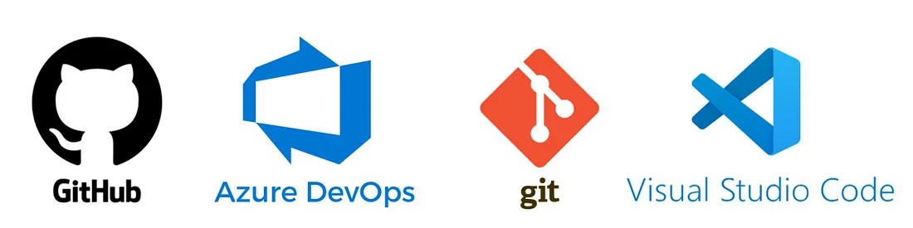

Before you begin, ensure you have the following prerequisites:

*   **GitHub account**: You will need a GitHub account to create a new repository and push your Playwright project to it. If you don’t have a GitHub account, you can create one for free at [github.com](https://github.com/).
*   **Azure DevOps account**: An Azure DevOps account is required to create and configure the CI/CD pipeline for your Playwright tests. If you don’t have an Azure DevOps account, you can sign up for one at [dev.azure.com](https://dev.azure.com/).
*   **Git** installed on your local machine: Git is a version control system that is used to manage your code changes. If you haven’t installed Git yet, you can download it from [git-scm.com](https://git-scm.com/).
*   **Visual Studio Code** (VS Code) installed on your local machine: VS Code is a lightweight but powerful source code editor. It is available for Windows, macOS, and Linux. You can download it from [code.visualstudio.com](https://code.visualstudio.com/).

## Step 1: Create new GitHub Project

1.  Login to GitHub, create a new GitHub project repository and clone it to your local machine.

## Step 2: Add .gitignore file

1.  On your local machine open the cloned GitHub repo in Visual Studio Code (VSCode).
2.  Create a `.gitignore` file and add the following directories:

```
node_modules/
test-results/
tests-examples/
playwright-report/
playwright/.cache/
```

## Step 3: Install Playwright


1.  In the Terminal window in VSCode, install Playwright using the command:
    `npm init playwright@latest `during installation select your preferred language TypeScript or JavaScript (example in this guide are shown in JavaScript) and accept other prompts with default selections.
2.  After the installation, Playwright generates example tests including a test file named `tests/example.spec.js` that contains two basic tests navigating to the Playwright Home Page URL and doing validations.
3.  Run the tests with the command `npx playwright test`

```
// example.spec.js 
const { test, expect } = require('@playwright/test');
test('has title', async ({ page }) => {
  await page.goto('https://playwright.dev/');
  // Expect a title "to contain" a substring.
  await expect(page).toHaveTitle(/Playwright/);
});
test('get started link', async ({ page }) => {
  await page.goto('https://playwright.dev/');
  // Click the get started link.
  await page.getByRole('link', { name: 'Get started' }).click();
  // Expects page to have a heading with the name of Installation.
  await expect(page.getByRole('heading', { name: 'Installation' })).toBeVisible();
});
```

## Step 4: Update the Playwright Config file

1.  Open the `playwright.config.js` file in VSCode and add the following:

```
// @ts-check
const { defineConfig, devices } = require('@playwright/test');
/**
 * @see https://playwright.dev/docs/test-configuration
 */
module.exports = defineConfig({
  testDir: './tests',
  /* Run tests in files in parallel */
  fullyParallel: true,
  /* Fail the build on CI if you accidentally left test.only in the source code. */
  forbidOnly: !!process.env.CI,
  /* Retry on CI only */
  retries: process.env.CI ? 2 : 0,
  /* Opt out of parallel tests on CI. */
  workers: process.env.CI ? 1 : undefined,
  /* Reporter to use. See https://playwright.dev/docs/test-reporters 
  Set to:'never', change to 'always' to launch report automatically after execution */
  reporter: [ 
    ['html', { open: 'never' }],
    ['junit', {outputFile: 'results.xml'}] //required for Azure DevOps Pipeline
  ],
  
  use: {
    /* Maximum time each action such as `click()` can take. 
        Defaults to 0 (no limit). */
    actionTimeout: 60 * 1000,
    navigationTimeout: 30 * 1000,
    /* Collect trace when retrying the failed test. 
    See https://playwright.dev/docs/trace-viewer */
    trace: 'on',
    screenshot: 'only-on-failure',
    video: {
      mode: 'on'
    },
    headless: true,
    viewport: { width: 1900, height: 940 },
    launchOptions: {
        slowMo: 500,
    },
  },
  
  /* Configure projects for major browsers */
  projects: [    {
      name: 'chromium',
      use: { ...devices['Desktop Chrome'] },
    },
    {
      name: 'firefox',
      use: { ...devices['Desktop Firefox'] },
    },
    {
      name: 'webkit',
      use: { ...devices['Desktop Safari'] },
    },
  ],
});
```

## Step 5: Run Playwright Tests

1.  Run Playwright test using `npx playwright test` command
2.  Optionally update package.json file with the following to run Playwright tests with the shortened test execution command `npm test`

```
"scripts": {
    "test": "npx playwright test --workers=1"
  },
```

## Step 6: Push updated Project to GitHub

1.  After executing your tests and confirming the tests run successfully push your repo to GitHub.
2.  Push all he updates to the project we’ve done so far to GitHub:
    `git add .`
    `git commit -m "Add Playwright Tests"`
    `git push`

At this point our project files are pushed to remote repository but we don’t yet have a pipeline that would execute the tests we just uploaded.

Next we’re going to configure Azure DevOps project and create the pipeline to run the tests via Azure DevOps.

## Step 7: Creating Azure DevOps Organization and Project

1.  **Create a new Azure DevOps organization:**

*   Go to [dev.azure.com](https://dev.azure.com/) and sign in with your Azure DevOps account.
*   Click on your profile icon in the top right corner and select "Organizations."
*   Click on the "New organization" link.
*   Enter a name for your organization and follow the prompts to create it.

**2. Create a new project in the organization:**

*   Once you’ve created the organization, click on the "New project" button on the organization’s home page.
*   Enter a name for your project, select the visibility (private), and choose a version control system (Git).
*   Click "Create" to create the project.

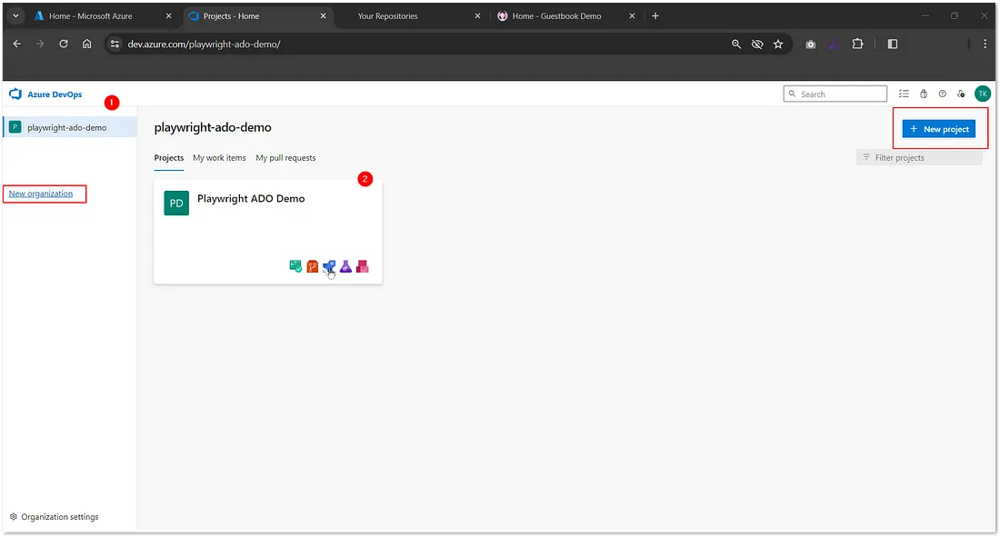

3. Select your new project and navigate to Pipelines

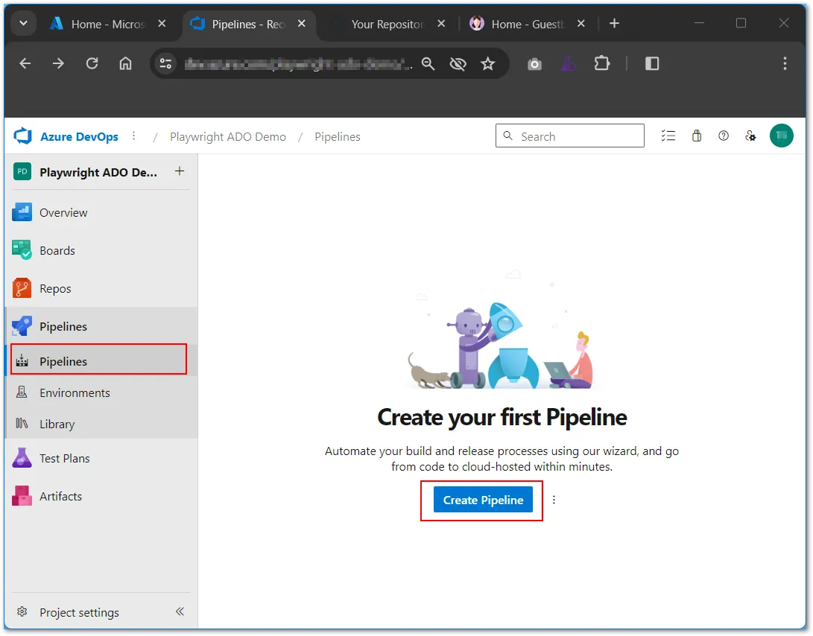

## Step 8: Creating pipeline YML files

Before we can create a pipeline in Azure DevOps, we need to add YAML files to our GitHub Playwright project and create instructions for running the pipeline. We are going to add two files: `playwright_template.yml` and `playwright-automation.yml`. Here's how you can do it:

### Adding YAML Files for Azure DevOps CI/CD Pipeline

1. Create a `azure-pipelines` directory in your Playwright project:

*   In your Visual Studio Code editor, navigate to the root of your Playwright project.
*   Create a new directory named `azure-pipelines`.

2. Add `playwright-template.yml` and `playwright-automation.yml` files inside the `azure-pipelines` directory:

3.  Edit the `playwright-template.yml` file:

*   Open the `playwright-template.yml` file in Visual Studio Code.
*   Add the the following YAML code to define the template for your Playwright tests. This file will contain the common steps and configurations that will be reused across different test scenarios.
*   This pipeline is designed to run Playwright tests in an Azure DevOps pipeline.
*   It defines a parameter `BASE_URL` that allows you to specify the base URL for your tests.
*   The pipeline consists of a single job named `test` that contains several steps:

1.  Use Node version 16: Sets the Node version to 16.x for the pipeline.
2.  NPM Install: Installs the project dependencies using `npm ci`.
3.  Playwright Install: Installs Playwright and its dependencies.
4.  Run Playwright Tests: Sets the `BASE_URL` parameter, configures Playwright to run in CI mode, specifies the output format for JUnit, and runs the Playwright tests. This step continues even if there are errors (`continueOnError: true`).
5.  Add playwright-report to Archive: Archives the `playwright-report` folder to a zip file.
6.  Add test-results to Archive: Archives the `test-results` folder to a zip file.
7.  Publish Pipeline Artifacts: Publishes the archived files as pipeline artifacts.
8.  Publish Test Results: Publishes the test results in JUnit format with the title "Playwright ADO Demo — $(System.StageName)".

```
parameters:
  - name: BASE_URL
    type: string
jobs:
  - job: test
    displayName: Run Playwright Tests
    steps:
      - download: none
      
      - checkout: self
      - task: NodeTool@0
        displayName: 'Use Node version 16'
        inputs:
          versionSpec: 16.x
      - script: |
          npm ci
        displayName: "NPM Install"
      - script: |
          npx playwright install --with-deps
        displayName: "Playwright Install"
      - script: |
          set BASE_URL=${{ parameters.BASE_URL }}
          set CI=true
          set PLAYWRIGHT_JUNIT_OUTPUT_NAME=results.xml
          npx playwright test
        displayName: "Run Playwright Tests"
        continueOnError: true
      - task: ArchiveFiles@2
        displayName: 'Add playwright-report to Archive'
        inputs:
          rootFolderOrFile: '$(Pipeline.Workspace)/s/playwright-report/'
          archiveFile: '$(Agent.TempDirectory)/$(Build.BuildId)_$(System.JobAttempt)$(System.StageAttempt).zip'
      - task: ArchiveFiles@2
        displayName: 'Add test-results to Archive'
        inputs:
          rootFolderOrFile: '$(Pipeline.Workspace)/s/test-results/'
          archiveFile: '$(Agent.TempDirectory)/$(Build.BuildId)_$(System.JobAttempt)$(System.StageAttempt).zip'
          replaceExistingArchive: false
      - task: PublishPipelineArtifact@1
        displayName: 'Publish Pipeline Artifacts'
        inputs:
          targetPath: '$(Agent.TempDirectory)/$(Build.BuildId)_$(System.JobAttempt)$(System.StageAttempt).zip'
          artifact: pipeline-artifacts
      - task: PublishTestResults@2
        inputs:
          testResultsFormat: 'JUnit'
          testResultsFiles: '$(Pipeline.Workspace)/s/results.xml'
          testRunTitle: 'Playwright ADO Demo - $(System.StageName)'
        displayName: 'Publish Test Results'
```

Edit the `playwright-automation.yml` file:

*   Open the `playwright-automation.yml` file in Visual Studio Code.
*   Add the necessary YAML code to define the pipeline for running your Playwright tests. This file will include steps to install dependencies, build the project, and run the Playwright tests.

```
pool:
  vmImage: 'windows-latest'
trigger:
  branches:
    include:
      - 'main'
name: $(Build.BuildId)
stages:
  - stage: qa
    displayName: 'Run Automation Test - QA'
    dependsOn: []
    jobs:
      - template: playwright-template.yml
        parameters:
          BASE_URL: ''
```

Creating a Pipeline in Azure DevOps
=========

Now we can create a new pipeline in Azure DevOps, select a Git repository, and choose the existing YAML files option:

**Sign in to Azure DevOps**:

*   Go to [dev.azure.com](https://dev.azure.com/) and sign in with your Azure DevOps account.

**Navigate to your project**:

*   Select the organization and project where you want to create the pipeline.

**Create a new pipeline**:

*   Click on "Pipelines" in the left sidebar.
*   Click on the "Create Pipeline" button.


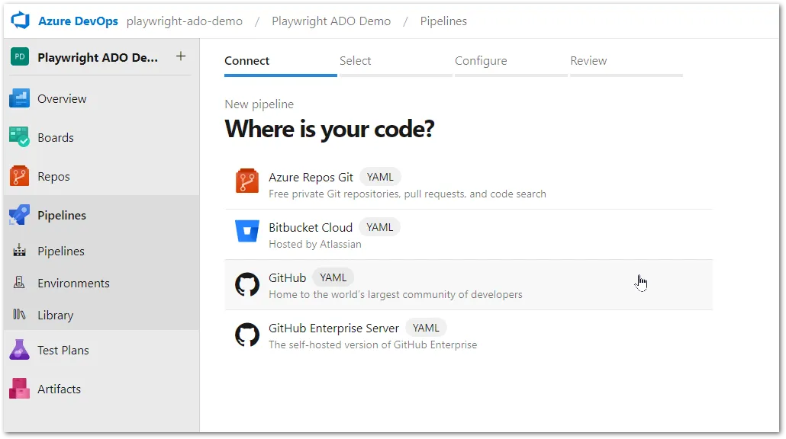

**Select your repository**:

*   In Where is your code?’ screen select GitHub (YAML) option
*   Choose the Git repository where your Playwright project is located.
*   If you haven’t connected your repository yet, click on "Connect" and follow the prompts to connect to your Git repository.

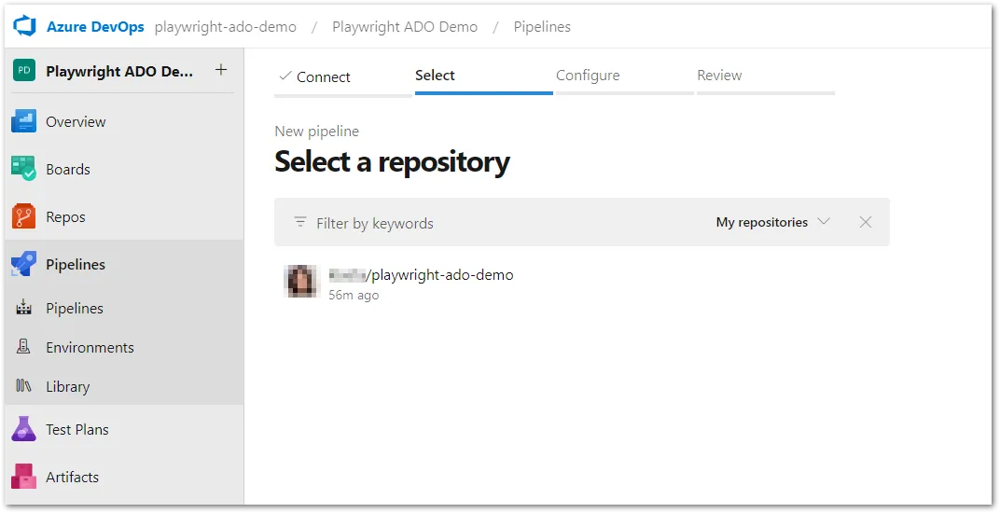

**Configure your pipeline:**

*   In the "Configure your pipeline" step, select "Existing Azure Pipelines YAML file" as the pipeline configuration method.
*   Click on the "YAML file path" field and select the `playwright-automation.yml` file from the `azure-pipelines` directory in your repository.

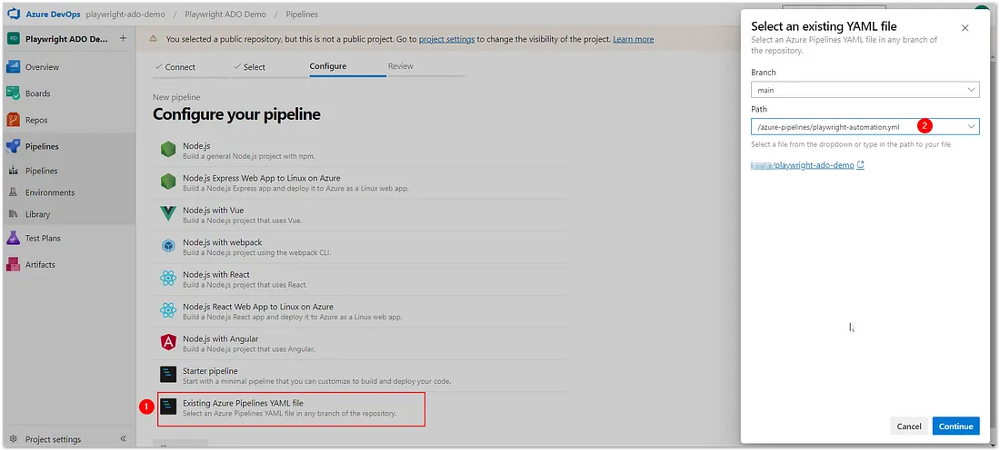

*   Click "Continue" to proceed.
*   Review the pipeline configuration to ensure it matches your requirements.
*   Click on "Run" to save the pipeline configuration and run the pipeline.

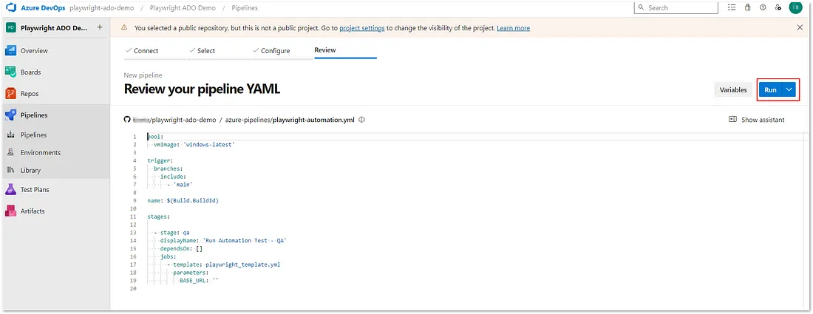

**Monitor the pipeline execution**:

*   Once the pipeline is running, you can monitor its progress in the Azure DevOps interface.
*   The pipeline will automatically run the tasks defined in your `playwright-automation.yml` file, such as installing dependencies, building the project, and running the Playwright tests.

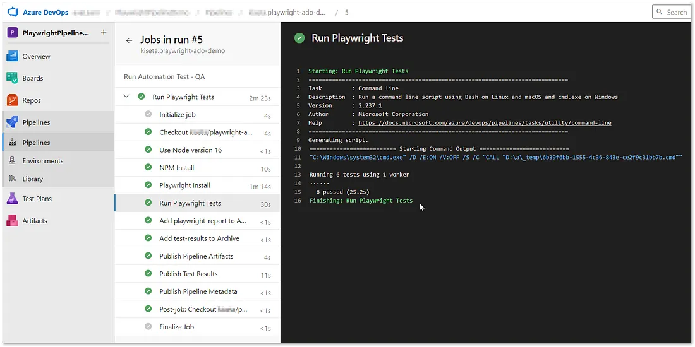

**View the results**:

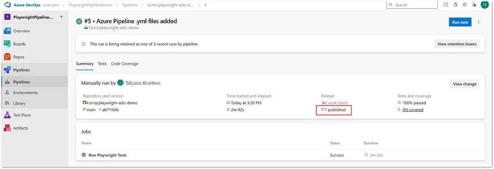

*   After the pipeline has completed, you can view the results of the Playwright tests in the Azure DevOps interface.
*   Any test failures or other issues will be reported in the pipeline logs.
*   You can download execution results including traces, video files, screenshots, etc and view them on your local machine

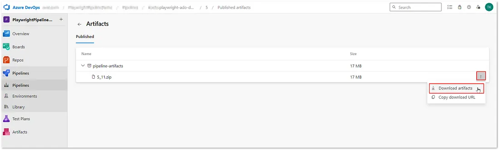

*   NOTE: Your Playwright tests are now set up to run automatically in Azure DevOps whenever you push changes to your Git repository.

Adding Pipeline Parameters


Adding pipeline parameters in Azure DevOps can be beneficial for several reasons.

*   It allows for greater flexibility and reusability of pipelines.
*   By defining parameters, you can customize the behavior of your pipeline based on different scenarios, such as deploying to different environments or running different sets of tests.
*   This flexibility reduces the need to create multiple similar pipelines, simplifying your pipeline configuration and maintenance.

To add a pipeline parameters to our example we going to modify project files as follows:

1.  Update Playwright tests in **example.spec.js** to use a global variable for website URL. Optionally, add a log statement to see how the global variable value is used in the test.

```
// @ts-check
const { test, expect } = require('@playwright/test');
test('has title', async ({ page }) => {
  await page.goto(global.BASE_URL);
  console.log('Test 1 [has title] : Global BASE_URL variable: ', global.BASE_URL)
  // Expect a title "to contain" a substring.
  await expect(page).toHaveTitle(/Playwright/);
});
test('get started link', async ({ page }) => {
  await page.goto(global.BASE_URL);
  console.log('Test 2 [get started link]: Global BASE_URL variable: ', global.BASE_URL)
  // Click the get started link.
  await page.getByRole('link', { name: 'Get started' }).click();
  // Expects page to have a heading with the name of Installation.
  await expect(page.getByRole('heading', { name: 'Installation' })).toBeVisible();
});

```

2. Update **playwright.config.js** to reference global variable

```
const { defineConfig, devices } = require('@playwright/test');
Object.assign(global, {
  BASE_URL: process.env.BASE_URL,
});
//... the rest of the playwright.config.js file
```

3. Update **playwright-automation.yml** with the BASE_URL value:

```
pool:
  vmImage: 'windows-latest'
trigger:
  branches:
    include:
      - 'main'
name: $(Build.BuildId)
stages:
  - stage: qa
    displayName: 'Run Automation Test - QA'
    dependsOn: []
    jobs:
      - template: playwright-template.yml
        parameters:
          BASE_URL: 'https://playwright.dev/'
```

4. Confirm **playwright-template.yml** file has BASE_URL parameter referenced as follows:

```
parameters:
  - name: BASE_URL
...
- script: |
          set BASE_URL=${{ parameters.BASE_URL }}
...
```

5. Push your updates to GitHub which will trigger automatic pipeline execution:

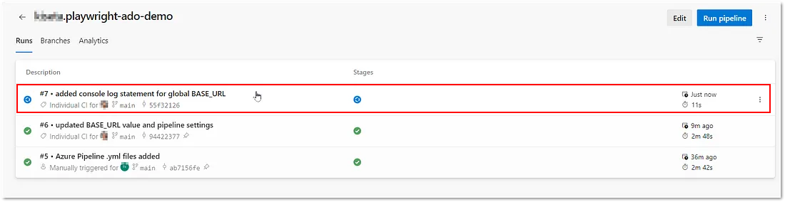

6. View Execution Results

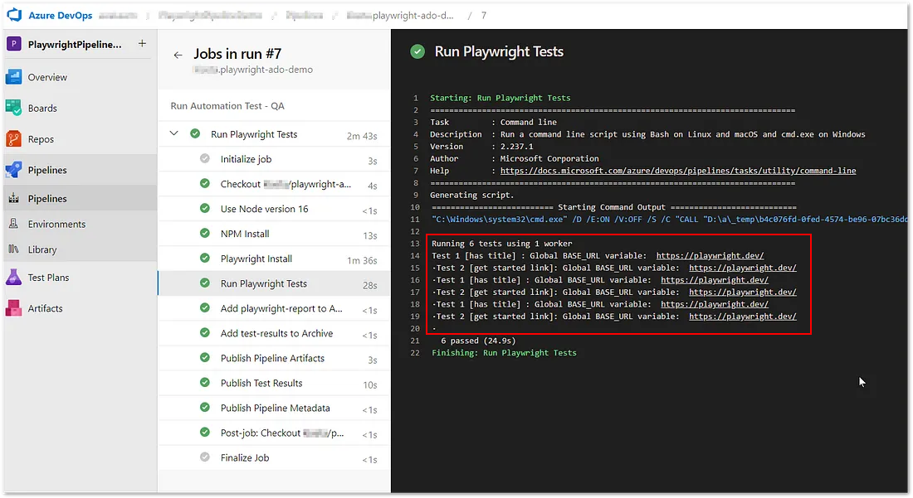

## Parting words


🎉This is it! Congratulations on successfully setting up the Azure DevOps pipeline for executing Playwright scripts. This basic example serves as a foundation that you can expand further to meet your specific testing needs.

🛠️ Consider adding additional steps for environment setup, parallel test execution, or integration with other tools to enhance your pipeline and optimize your testing process.

🔍 Keep exploring and refining your pipeline to make the most out of Azure DevOps and Playwright.

👏 Great job, and happy testing! 🚀